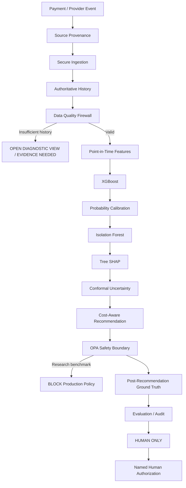

# RazorTrust

> A defense-only AI Risk Manager for payment and settlement review - measurable, explainable, bounded, and human-gated.

Built for the **Razorpay AI Buildathon - Track 02: AI Risk Manager**.

RazorTrust combines supervised fraud scoring, anomaly detection, calibrated probabilities, conformal uncertainty, SHAP explanations, provenance, deterministic OPA guardrails, audit evidence, and mandatory human authorization.

**RazorTrust does not autonomously release money.**

---

## Buildathon result at a glance

### Public real-world benchmark

RazorTrust includes a research-only benchmark built on the public anonymized **ULB / Worldline credit-card fraud dataset**.

| Item | Verified result |
|---|---:|
| Benchmark version | `ulb-creditcard-xgb-if@1.3` |
| Rows | 284,807 |
| Fraud-labelled rows | 492 |
| Split | chronological 60 / 20 / 20 |
| Frozen evaluation rows | 56,962 |
| Average Precision | 0.7924385 |
| ROC-AUC | 0.9784368 |
| Precision | **86.36%** |
| Recall | **76.00%** |
| F1 | **80.85%** |
| Brier score | 0.000402506 |
| True positives | 57 |
| False positives | **9** |
| True negatives | 56,878 |
| False negatives | 18 |
| False-positive rate | **0.0158%** |
| Frozen classifier threshold | 0.25 |
| Evaluation cost units | 369 |

Frozen evaluation confusion matrix:

```text
                      Predicted
                   Legit     Fraud
Actual Legit      56,878         9
Actual Fraud          18        57
```

Cost model used for classifier threshold selection:

```text
false-negative cost = 20
false-positive cost = 1
```

Threshold selection is performed on calibration data, not on frozen evaluation labels.

See [`docs/buildathon-final/RESULTS.md`](docs/buildathon-final/RESULTS.md).

---

## Safety is part of the model contract

The validated live runtime is intentionally human-gated:

```text
decision_mode = human_only
risk_runtime = human-only@1
policy_mode = opa
production_action_eligible = false
automatic_release_enabled = false
human_authorization_required = true
```

The public benchmark is research-only and cannot replace the settlement production runtime.

AI may:

- score risk;
- identify anomalous behavior;
- calibrate probability;
- explain contributing signals;
- express uncertainty;
- request evidence;
- recommend escalation or review.

AI may not:

- automatically release settlement funds;
- bypass OPA;
- convert a public benchmark result into a production money action;
- silently promote a research model;
- resolve a hold without named human authorization.

The settlement-release research program deliberately stopped when no candidate met the autonomous-release safety gate:

```text
FINAL_ML_STOP_NO_SAFE_RELEASE_CANDIDATE
```

A failed promotion gate is treated as evidence, not something to tune away.

---

## Blind evaluation integrity

A blind held-out case is returned without its source label:

```text
source_label = null
label_revealed = false
```

The validated runtime executes:

```text
SOURCE_PROVENANCE
DATASET_INTEGRITY
CHRONOLOGICAL_SPLIT
BENCHMARK_XGBOOST
PROBABILITY_CALIBRATION
ISOLATION_FOREST
SHAP
CONFORMAL_UNCERTAINTY
BENCHMARK_RECOMMENDATION
OPA
SOURCE_GROUND_TRUTH
HUMAN_ONLY
```

Ground truth is read only after scoring and recommendation:

```text
truth_access_mode = POST_RECOMMENDATION_ONLY
used_for_model_scoring = false
used_for_calibration_of_this_case = false
held_out_labels_used_for_recommendation = false
```

For the validated blind trace:

- OPA status: `BLOCKED`;
- production policy input submitted: `false`;
- final state: `WAITING_FOR_HUMAN`;
- automatic release: `false`;
- human authorization required: `true`.

The frozen evaluation split has been inspected and is not used for further model or threshold tuning.

---

## Architecture



Detailed architecture: [`docs/buildathon-final/ARCHITECTURE.md`](docs/buildathon-final/ARCHITECTURE.md)

---

## What RazorTrust implements

### Risk and ML

- Point-in-time risk features.
- Locked feature contracts.
- XGBoost supervised scoring.
- Sigmoid probability calibration.
- Legitimate-only Isolation Forest novelty detection.
- Tree SHAP explanations.
- Split-conformal uncertainty.
- Cost-aware recommendation logic.
- Drift and research-gate instrumentation.
- Explicit research-only public benchmark isolation.

### Evaluation integrity

- Chronological train / calibration / frozen-evaluation partitioning.
- Held-out labels blocked from scoring and recommendation.
- Post-recommendation truth access.
- Calibration-legitimate-only Isolation Forest reference.
- Raw and normalized dataset SHA256 verification.
- Strict benchmark metadata schema with unknown fields rejected.
- Full regression suite and blind runtime integrity gate.

### Financial safety

- Explicit `human_only` enforcement mode.
- OPA policy boundary.
- Named human authorization.
- No automatic settlement release.
- Idempotent hold, evidence and authorization operations.
- Evidence-round and state-machine constraints.
- Fail-closed readiness and policy behavior.
- Signed model-release infrastructure for research/development provenance.

### Audit and operations

- PostgreSQL-backed persistence.
- Transactional audit/outbox behavior.
- Hash-linked audit evidence.
- Trace propagation and OpenTelemetry support.
- Browser-based operator console.
- Evidence dossier generation.
- Case provenance and attribution records.
- Human override and escalation workflows.

---

## Razorpay webhook ingestion

RazorTrust includes a privacy-minimised Razorpay webhook ingestion gateway separated from financial execution.

It:

- verifies `X-Razorpay-Signature` against the exact raw request body;
- uses `x-razorpay-event-id` for duplicate-delivery protection;
- stores a minimal event summary;
- hashes the raw body for integrity;
- discards unnecessary raw payment/customer data after verification;
- never treats webhook ingestion as authority to release money.

Configuration:

```text
RAZORTRUST_RAZORPAY_ENABLED=false
RAZORTRUST_RAZORPAY_MODE=test
RAZORTRUST_RAZORPAY_KEY_ID=
RAZORTRUST_RAZORPAY_KEY_SECRET=
RAZORTRUST_RAZORPAY_WEBHOOK_SECRET=
RAZORTRUST_RAZORPAY_BASE_URL=https://api.razorpay.com/v1
```

Relevant endpoints:

```text
POST /v1/integrations/razorpay/webhook
GET  /v1/integrations/razorpay/status
```

Keep Razorpay integration in test/shadow mode until end-to-end operational review controls are validated.

---

## Run the validated HUMAN_ONLY stack

### Requirements

- Docker Desktop / Docker Compose
- Git
- Local ports used by the stack available

From the repository root:

```powershell
cd C:\Projects\RazorTrust

docker compose `
  -f .\docker-compose.yml `
  -f .\docker-compose.human-only.yml `
  -f .\docker-compose.layer-execution.yml `
  up -d --build
```

Check services:

```powershell
docker compose `
  -f .\docker-compose.yml `
  -f .\docker-compose.human-only.yml `
  -f .\docker-compose.layer-execution.yml `
  ps
```

Verify the safety contract:

```powershell
curl.exe --http1.1 http://localhost:8000/health/ready
```

Expected safety fields:

```json
{
  "status": "ready",
  "decision_mode": "human_only",
  "risk_runtime": "human-only@1",
  "policy_mode": "opa",
  "model_version": "human-only@1"
}
```

Open:

- Operator UI: `http://localhost:8000/`
- OpenAPI: `http://localhost:8000/docs`

Do not set `RAZORTRUST_MODEL_RELEASE_PATH` for the validated Buildathon HUMAN_ONLY runtime.

---

## Check the public benchmark

Read benchmark status:

```powershell
curl.exe --http1.1 `
  http://localhost:8000/v1/public-benchmark/ulb/status
```

Validated frozen artifact:

```text
status = READY
benchmark_version = ulb-creditcard-xgb-if@1.3
research_only = true
production_action_eligible = false
automatic_release_enabled = false
human_authorization_required = true
held_out_labels_used_for_recommendation = false
if_reference_split = CALIBRATION_LEGITIMATE_ONLY
```

For the Buildathon demo, use the already-prepared artifact. Do not retrain or retune the frozen evaluation result to improve presentation metrics.

---

## Five-minute judge demo

Final timed script:

[`docs/buildathon-final/DEMO-SCRIPT.md`](docs/buildathon-final/DEMO-SCRIPT.md)

The demo is structured around five questions:

1. What financial-risk problem does RazorTrust solve?
2. What measurable result does the detector achieve?
3. What is the honest false-positive and false-negative behavior?
4. Can the AI recommendation cross the financial safety boundary?
5. What happens when the system is uncertain or wrong?

Answer to question 4:

> No. OPA blocks the research benchmark from production policy and final authority remains HUMAN_ONLY.

---

## Evidence package

The validated core has been cryptographically frozen and a final evidence bundle generated under:

```text
artifacts/research/validated-core-freeze-*
artifacts/submission/razortrust-evidence-*
```

The freeze package records:

- critical source SHA256 hashes;
- benchmark status and metrics;
- dataset hashes;
- live safety mode;
- Git state;
- evaluation-integrity assertions.

Final judge-facing docs:

- [`ARCHITECTURE.md`](docs/buildathon-final/ARCHITECTURE.md)
- [`RESULTS.md`](docs/buildathon-final/RESULTS.md)
- [`DEMO-SCRIPT.md`](docs/buildathon-final/DEMO-SCRIPT.md)
- [`SUBMISSION-CHECKLIST.md`](docs/buildathon-final/SUBMISSION-CHECKLIST.md)
- [`SHA256SUMS.txt`](docs/buildathon-final/SHA256SUMS.txt)

---

## Research history and claim separation

RazorTrust contains earlier synthetic and staged research used to validate mechanics, leakage controls, model-release gates and failure behavior.

Those historical experiments are not presented as the public real-world fraud benchmark and are not substituted for the verified `@1.3` result.

Important principle:

> A failed promotion gate is a valid result.

Research candidates that failed safety or recall requirements remain non-promotable.

For technical history see:

- [`docs/completion-report.md`](docs/completion-report.md)
- [`docs/final-ml-research-cycle.md`](docs/final-ml-research-cycle.md)
- [`docs/red-team-scenarios.md`](docs/red-team-scenarios.md)
- [`docs/regulatory-control-map.md`](docs/regulatory-control-map.md)
- [`docs/policy-signing.md`](docs/policy-signing.md)

---

## Verification

The validated repository passed the complete Python test suite after the final benchmark integrity and schema fixes.

Typical local verification:

```powershell
.venv\Scripts\ruff check .
.venv\Scripts\ruff format --check .
.venv\Scripts\mypy src scripts
.venv\Scripts\pytest tests
```

The Docker-based full-test environment covers optional ML/research dependencies.

Tests cover:

- temporal leakage;
- feature contracts;
- benchmark schema strictness;
- post-recommendation truth access;
- policy parity;
- authorization scoping;
- idempotency;
- evidence-round enforcement;
- release signatures;
- database transactions;
- audit tampering;
- model evaluation;
- known failure modes.

---

## Repository map

```text
src/razortrust/            API, workflow, policy adapters, persistence, audit and frontend
src/razortrust/ml/         training, calibration, evaluation, release and research gates
policies/                  Rego policies
alembic/                   PostgreSQL migrations
scripts/                   training, evaluation, demo and operations tooling
tests/                     unit, contract, regression and database tests
docs/                      technical evidence and controls
docs/buildathon-final/     judge-facing architecture, results, demo and checklist
artifacts/research/        research and frozen-core evidence
artifacts/submission/      final submission evidence bundles
experimental/              archived research outside the live application path
```

---

## Claim boundaries

RazorTrust does not claim:

- every fraud can be detected;
- zero false negatives;
- a payment failure is automatically fraud;
- Razorpay settlement ground truth from the public ULB dataset;
- the public benchmark is a production settlement model;
- autonomous authority to move or release money.

A provider payment failure remains a payment failure unless authoritative evidence establishes something more.

The public benchmark demonstrates measurable fraud-classification behavior on a public anonymized dataset. The operational system demonstrates how that evidence is bounded by provenance, uncertainty, policy, audit and human authority.

---

## Security boundaries

- Never commit `.env` files, private keys, credentials or secret material.
- Never expose provider/customer secrets in telemetry.
- OPA enforces operational constraints; it does not calculate model risk.
- Ed25519 release signatures prove artifact integrity/provenance, not model quality.
- Webhook signatures must be computed over the exact raw request body.
- Duplicate Razorpay webhook deliveries must be handled idempotently.
- PostgreSQL is authoritative when database mode is enabled.
- Public benchmark recommendations never authorize settlement release.
- AI recommendations never resolve a hold without named human authorization.
- Production rollout still requires managed key custody, signed policy distribution, external immutable audit checkpoints, real processor ground truth, human-review operations, shadow/canary validation and rollback procedures.

---

## License

Released under the [MIT License](LICENSE).