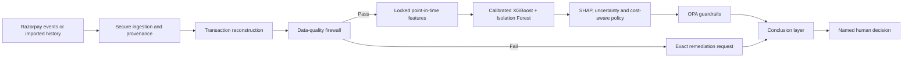

# RazorTrust

> A leakage-safe, explainable AI risk workspace for payment and settlement review.

[](https://github.com/darioanderson/RazorTrust/actions/workflows/ci.yml)
[](LICENSE)

RazorTrust turns payment and merchant activity into an auditable recommendation:

- `RELEASE` — available evidence supports release;
- `EVIDENCE_NEEDED` — uncertainty can be reduced with specific evidence;
- `ESCALATE` — risk or unresolved uncertainty requires specialist review.

The system reconstructs point-in-time history, rejects unsafe inputs, builds a locked 13-feature vector, runs calibrated risk and novelty analysis, explains the strongest signals, and applies deterministic policy controls. A conclusion layer then presents the complete case story and next action in one operator view.

**AI recommendations never release funds automatically. A named human remains the final authority.**

## Current operating status

| Capability | Status |
|---|---|
| Operator decision mode | `HUMAN_ONLY` |
| Operational runtime | `human-only@1` |
| Signed analysis model | `xgb-if-settlement@2` |
| Analysis role | Shadow decision support; no money-movement authority |
| Policy enforcement | OPA, fail closed |
| Razorpay integration | Test/reconciliation workflow |
| Public fraud benchmark | Research only |
| Dispute model | Pipeline ready; promotion awaits sufficient mature real labels |

`xgb-if-settlement@2` is the current signed analysis champion. It can inform a case recommendation only after the data-quality firewall passes. It is deliberately isolated from final financial execution.

## System flow



The production-facing path is designed to fail closed. Missing history, incomplete telemetry, invalid provenance, unavailable artifacts, or policy failure cannot silently become a release recommendation.

## What the platform provides

### Real payment and merchant history

- Razorpay webhook signature verification against the exact raw body.
- Idempotent event handling using the provider event ID.
- Provider-backed payment and stored-hold lookup.
- Reconstructed baseline and current activity windows.
- JSON and CSV history import with strict server-side validation.
- Import provenance, content hashing, and source attestation.
- Privacy-minimised storage and telemetry.

### Leakage-safe ML

- Chronological train, calibration, and frozen-evaluation splits.
- Point-in-time feature construction with a locked 13-feature contract.
- XGBoost supervised risk scoring.
- Calibrated probabilities.
- Legitimate-reference Isolation Forest novelty scoring.
- Tree SHAP signal explanations.
- Cost-aware action selection.
- Signed artifact manifests and explicit promotion gates.

Autoencoder/OOD, conformal uncertainty, graph intelligence, and newer temporal layers remain research capabilities until they demonstrate measurable safety and cost improvement without increasing legitimate-merchant friction.

### Safe operations

- Deterministic OPA guardrails.
- Human-only authorization for unresolved and high-risk cases.
- Exact evidence requests when additional facts can resolve uncertainty.
- Idempotent holds, evidence submissions, and authorization actions.
- Hash-linked audit records and transactional outbox behavior.
- Evidence dossiers, trace propagation, and model attribution.
- A complete conclusion layer covering source, history, quality, risk, dispute status, strongest signals, unresolved questions, and next action.

## Operator workspace

The single-page operator interface is served from the API root. It supports:

- provider-backed payment selection;
- stored-hold lookup;
- full case-field inspection;
- real-history JSON paste or file upload;
- deterministic CSV-to-JSON conversion before validated import;
- reason, cohort, scoring-window, and review context entry;
- data-quality blockers with concrete remediation;
- stage-by-stage execution visibility;
- calibrated probabilities, novelty, explanations, and policy outcome;
- evidence submission and named human authorization;
- a final narrative that connects every system layer.

The interface does not generate hidden sample records or substitute demo values for missing real history.

## Quick start

### Requirements

- Docker Desktop with Docker Compose
- Git
- Local ports `8000`, `5432`, `6379`, and `8181` available, or equivalent overrides

From the repository root in PowerShell:

```powershell
cd C:\Projects\RazorTrust

docker compose `
  -f .\docker-compose.yml `
  -f .\docker-compose.human-only.yml `
  -f .\docker-compose.layer-execution.yml `
  up -d --build
```

Check readiness:

```powershell
curl.exe --http1.1 http://localhost:8000/health/ready
```

The response should identify the human-only operational runtime and the signed shadow analysis model:

```json
{
  "status": "ready",
  "decision_mode": "human_only",
  "risk_runtime": "human-only@1",
  "analysis_runtime_status": "READY",
  "analysis_model_version": "xgb-if-settlement@2",
  "policy_mode": "opa"
}
```

Open:

- Operator workspace: [http://localhost:8000/](http://localhost:8000/)
- OpenAPI documentation: [http://localhost:8000/docs](http://localhost:8000/docs)

Stop the stack with the same Compose files:

```powershell
docker compose `
  -f .\docker-compose.yml `
  -f .\docker-compose.human-only.yml `
  -f .\docker-compose.layer-execution.yml `
  down
```

## When a real case can be scored

The default settlement analysis contract requires:

| Requirement | Default |
|---|---:|
| Historical baseline | 30 days |
| Minimum baseline transactions | 30 |
| Minimum baseline active days | 7 |
| Current activity window | 24 hours |
| First-party telemetry | Complete for required fields |

A newly created provider test payment usually has no meaningful merchant baseline. In that case, `INSUFFICIENT_BASELINE_TRANSACTIONS`, `INSUFFICIENT_BASELINE_ACTIVE_DAYS`, or `CURRENT_WINDOW_TELEMETRY_INCOMPLETE` is the correct result. The UI explains which history or telemetry must be imported or collected; it does not fabricate a score.

Once authoritative history satisfies the contract, the feature engine and signed shadow model can run. The resulting recommendation still passes through OPA and named human review.

## Real-history import

The operator can import an authoritative history bundle as JSON. Every imported record is validated by the API, linked to its source, and hashed for traceability. CSV files are converted deterministically in the browser and then submitted through the same validated JSON contract.

Imported data should represent actual processor, reconciliation, order, fulfilment, refund, dispute, or first-party telemetry records. Synthetic rows must not be presented as real operational history.

The dispute-training pipeline also requires mature labels with a known observation horizon. Pipeline readiness does not imply that a deployable dispute model exists. RazorTrust refuses to claim training readiness when authoritative stores or sufficient mature outcomes are unavailable.

## Public real-world benchmark

RazorTrust includes a research-only benchmark built from the public anonymized ULB/Worldline credit-card fraud dataset.

| Metric | Frozen evaluation result |
|---|---:|
| Benchmark artifact | `ulb-creditcard-xgb-if@1.3` |
| Dataset rows | 284,807 |
| Fraud-labelled rows | 492 |
| Split | Chronological 60 / 20 / 20 |
| Frozen evaluation rows | 56,962 |
| Average precision | 0.7924385 |
| ROC-AUC | 0.9784368 |
| Precision | 86.36% |
| Recall | 76.00% |
| F1 | 80.85% |
| Brier score | 0.000402506 |
| False-positive rate | 0.0158% |
| Classifier threshold | 0.25 |

Frozen confusion matrix:

```text
                      Predicted
                   Legit     Fraud
Actual Legit      56,878         9
Actual Fraud          18        57
```

The threshold was selected using calibration data with a false-negative cost of 20 and false-positive cost of 1. Frozen evaluation labels were not used for threshold tuning.

This benchmark demonstrates measurable classification and calibration behavior on a real-world anonymized dataset. It is not Razorpay settlement ground truth, not a dispute model, and not eligible to authorize a production action.

Read the loaded benchmark status:

```powershell
curl.exe --http1.1 http://localhost:8000/v1/public-benchmark/ulb/status
```

## Core API surface

| Endpoint | Purpose |
|---|---|
| `GET /health/ready` | Operational, policy, and analysis readiness |
| `POST /v1/integrations/razorpay/webhook` | Verified Razorpay event ingestion |
| `GET /v1/integrations/razorpay/status` | Provider configuration and ingestion status |
| `GET /v1/integrations/razorpay/payment-candidates` | Provider payments available to inspect |
| `POST /v1/integrations/razorpay/payments/{payment_id}/case` | Reconstruct a provider payment as a review case |
| `GET /v1/operator-history/candidates` | Imported transactions available to inspect |
| `POST /v1/operator-history/import` | Validate and import an authoritative history bundle |
| `POST /v1/operator-history/{dataset_id}/transactions/{transaction_id}/layer-execution` | Execute an imported-history trace |
| `POST /v1/holds/{hold_id}/layer-execution` | Execute a stored or reconstructed case trace |
| `GET /v1/public-benchmark/ulb/status` | Read the frozen public benchmark result |

The OpenAPI page at `/docs` is the authoritative reference for request and response schemas in the running version.

## Razorpay configuration

Razorpay integration is disabled by default and should remain in test or shadow mode until operational controls are validated end to end.

```text
RAZORTRUST_RAZORPAY_ENABLED=false
RAZORTRUST_RAZORPAY_MODE=test
RAZORTRUST_RAZORPAY_KEY_ID=
RAZORTRUST_RAZORPAY_KEY_SECRET=
RAZORTRUST_RAZORPAY_WEBHOOK_SECRET=
RAZORTRUST_RAZORPAY_BASE_URL=https://api.razorpay.com/v1
```

Never commit credentials or `.env` files. Webhook verification proves event authenticity; a verified webhook is still not authority to release funds.

## Verification

Create an environment and install the complete development extras:

```powershell
python -m venv .venv
.\.venv\Scripts\Activate.ps1
python -m pip install --upgrade pip
python -m pip install -e ".[test,ml,novelty,graph,drift,uncertainty]"
```

Run the same core quality gates used by CI:

```powershell
python -m ruff check src scripts tests
python -m ruff format --check src scripts tests
python -m mypy src/razortrust
python -m pytest tests
opa test policies -v
```

The suite covers temporal leakage, feature contracts, benchmark integrity, post-recommendation truth access, policy parity, authorization scope, evidence rounds, idempotency, database transactions, audit tampering, release signatures, and known failure modes.

## Security and governance boundaries

- No AI output can directly move or release money.
- OPA failures and dependency failures are fail-closed.
- Public benchmark recommendations are isolated from operational policy input.
- Model artifacts require verified manifests and signatures before loading.
- Artifact signatures prove integrity and provenance, not model quality.
- Ground truth is accessed after recommendation during evaluation workflows.
- PostgreSQL is authoritative when database mode is enabled.
- Raw provider/customer secrets must not enter logs or telemetry.
- Duplicate webhooks and operator actions are handled idempotently.
- Production rollout requires managed key custody, signed policy distribution, immutable external audit checkpoints, processor ground truth, staffed review operations, shadow/canary validation, and rollback procedures.

## Repository map

```text
src/razortrust/        API, workflows, persistence, policy, audit, ML and operator UI
src/razortrust/ml/     features, training, calibration, evaluation and release gates
policies/              Rego policy controls
alembic/               PostgreSQL migrations
scripts/               training, evaluation and operational tooling
tests/                 unit, contract, regression and database tests
docs/                  architecture, controls, research and operational guidance
artifacts/research/    frozen research artifacts and validation evidence
artifacts/submission/  reproducible evidence bundles
experimental/          archived work outside the active serving path
```

Useful technical references:

- [Completion report](docs/completion-report.md)
- [ML research cycle](docs/final-ml-research-cycle.md)
- [Red-team scenarios](docs/red-team-scenarios.md)
- [Regulatory control map](docs/regulatory-control-map.md)
- [Policy signing](docs/policy-signing.md)

## Claim boundaries

RazorTrust does not claim perfect fraud detection, zero false negatives, or autonomous financial authority. A failed payment is not automatically fraud, public benchmark data is not Razorpay settlement truth, and research artifacts are not promoted because their metrics look promising.

The project optimizes for low false releases, low unnecessary merchant friction, unknown-risk detection, calibrated probabilities, interpretable signals, strict leakage prevention, reproducible governance, and safe failure behavior.

## License

Released under the [MIT License](LICENSE).
