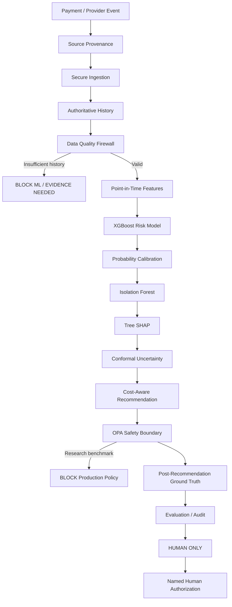

# RazorTrust - Architecture

## One-line idea

RazorTrust is a defense-only AI risk decision system that combines fraud scoring, anomaly detection, uncertainty estimation, explainability, policy gating, provenance, and human authorization.

It does not autonomously release money.

---

## System Architecture



---

## Public Benchmark Pipeline

The public real-world benchmark uses the ULB / Worldline anonymized credit-card fraud dataset.

Chronological split:

- Train: 170,884 rows
- Calibration: 56,961 rows
- Frozen evaluation: 56,962 rows

Pipeline:

```text
Chronological data
        |
        v
TRAIN
  |
  +--> XGBoost fit
  |
  +--> Isolation Forest fit on TRAIN legitimate only

CALIBRATION
  |
  +--> sigmoid probability calibration
  |
  +--> cost-aware classifier threshold selection
  |
  +--> Isolation Forest legitimate reference
  |
  +--> conformal calibration

FROZEN EVALUATION
  |
  +--> model score
  +--> calibrated probability
  +--> anomaly percentile
  +--> SHAP explanation
  +--> conformal uncertainty
  +--> recommendation
  +--> OPA safety block
  |
  +--> only then reveal source ground truth
```

---

## Evaluation Integrity

The benchmark implementation enforces:

- chronological 60 / 20 / 20 splitting;
- held-out labels excluded from recommendation;
- held-out labels excluded from scoring;
- case labels revealed only after recommendation;
- `truth_access_mode = POST_RECOMMENDATION_ONLY`;
- Isolation Forest reference = `CALIBRATION_LEGITIMATE_ONLY`;
- public benchmark is research-only;
- public benchmark is not production-action eligible.

The frozen evaluation split has now been inspected and is treated as a frozen evaluation set. It must not be used for further tuning.

---

## Safety Architecture

### AI recommendation

The AI may:

- score risk;
- identify anomalies;
- explain important features;
- express uncertainty;
- request evidence;
- escalate;
- recommend review.

### Financial authority

The AI may NOT:

- automatically release money;
- bypass OPA;
- promote the research benchmark to production;
- silently replace the production champion.

Final state:

```text
decision_mode = human_only
risk_runtime = human-only@1
policy_mode = opa
automatic_release_enabled = false
human_authorization_required = true
```

---

## Why Multiple Layers?

A binary classifier alone can be confidently wrong.

RazorTrust therefore combines several independent signals:

1. XGBoost - supervised fraud probability.
2. Calibration - probability reliability.
3. Isolation Forest - novelty / anomaly signal.
4. SHAP - explanation of model contribution.
5. Conformal uncertainty - abstention / uncertainty.
6. Cost-aware policy - false-negative vs false-positive trade-off.
7. OPA - deterministic safety boundary.
8. Human authorization - final financial authority.

The objective is not merely:

> Did the classifier say fraud?

The stronger question is:

> When the classifier may be wrong, does the system expose uncertainty, route the case safely, preserve evidence, and prevent an unsafe financial action?

---

## Production Separation

The public benchmark:

```text
ulb-creditcard-xgb-if@1.3
```

is research-only.

The live enforcement runtime remains:

```text
human-only@1
```

The public benchmark never replaces the settlement production model.